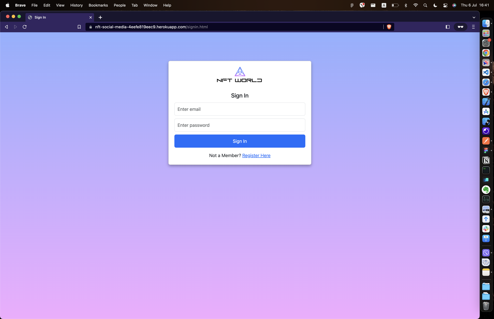
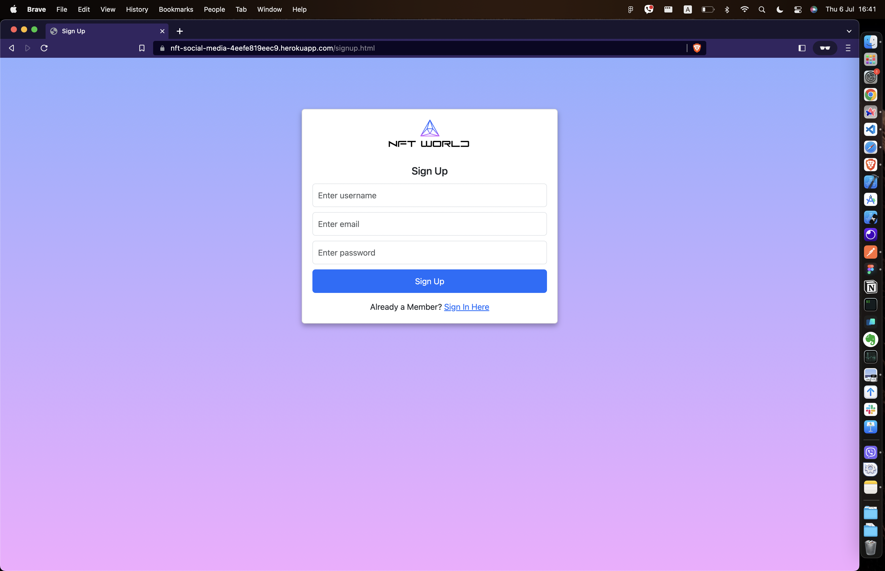
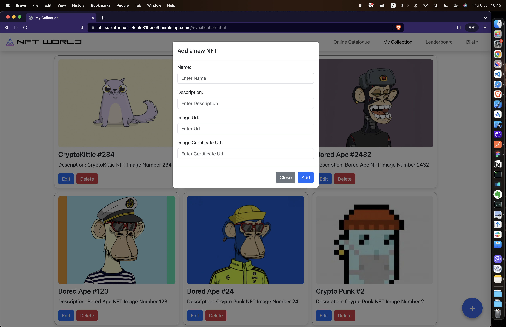
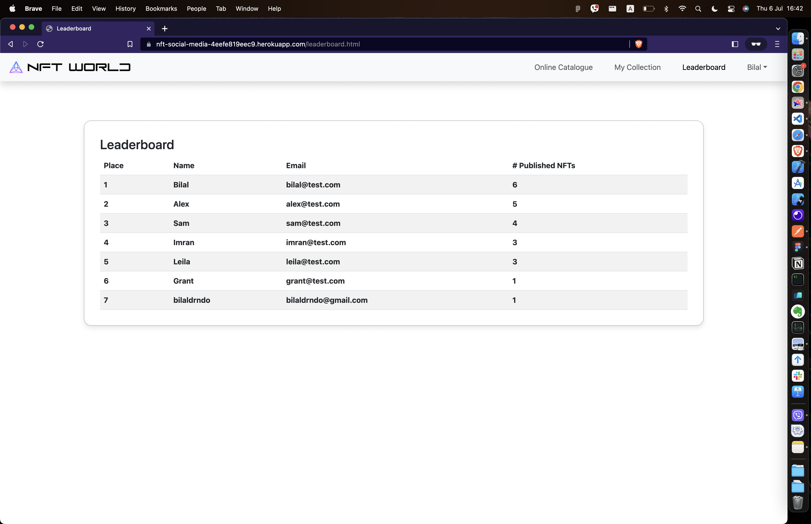
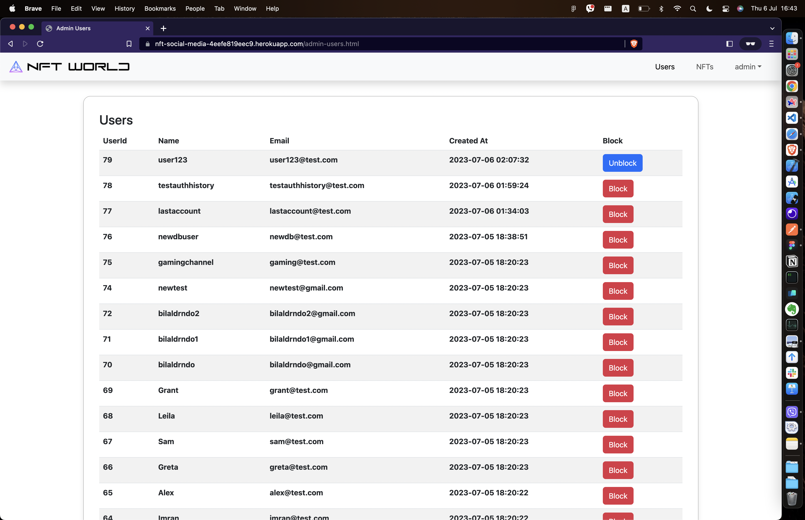
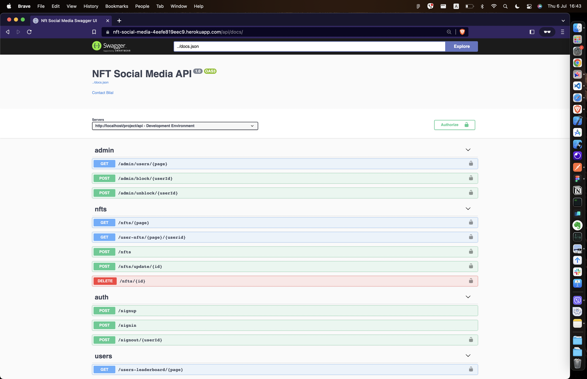

# NFT Showcase Social Media Website 

NFT Social Media Wesbite built with:
    - HTML, CSS, JS - Frontend
    - PHP - Backend

### Website Uses:
    - Composer - dependency installation
    - Boostrap - UI Components
    - JQueruy - misc UI manipulation
    - Ajax - web requests
    - MySQL - database
    - JWT Tokens - session management
    - Swagger - API documentation

## Screenshots of the website:

| Sign In                                   | Sign Up                                       |
|-------------------------------------------|-----------------------------------------------|
|  |      |
| 
**Home**                          | 
**My Collection**                     |
|  |      |
| 
**My Collection - Add New NFT**   | 
**My Collection - Edit Existing NFT** |
|  |      |
| 
**Users Leaderboard**             | 
**Admin - Users**                     |
|  |      |
| 
**Admin - NFTS**                  | 
**API Documentation**                 |
|  |     |

## SQL Queries:
### User
~~~sql
INSERT INTO auth_history (userId, time, type)
VALUES (:userId, NOW(), :type)
~~~

~~~sql
SELECT COUNT(*) as count
FROM users
WHERE username = :username OR email = :email
~~~

~~~sql
INSERT INTO users (username, email, password, createdAt, isAdmin)
VALUES (:username, :email, :password, NOW(), false)
~~~

~~~sql
SELECT * FROM users
WHERE email = :email
~~~

~~~sql
SELECT COUNT(*) as count
FROM blocked
WHERE userId = :id
~~~

~~~sql
SELECT users.username, users.email, users.id as userId, COUNT(nfts.userId) AS numOfpublishedNfts
FROM nfts 
JOIN users ON nfts.userid=users.id 
GROUP BY users.id 
ORDER BY numOfpublishedNfts DESC
LIMIT :limit
OFFSET :offset
~~~

### NFT
~~~sql
INSERT INTO nft_history (nftId, time, type)
VALUES (:nftId, NOW(), :type)
~~~

~~~sql
SELECT nfts.id as nftId, users.id as userId, users.username, nfts.name, nfts.image, nfts.certificate, nfts.description 
FROM nfts 
JOIN users ON nfts.userid=users.id 
ORDER BY nftId DESC
LIMIT :limit
OFFSET :offset
~~~

~~~sql
SELECT id as nftId, name, image, certificate, description
FROM nfts
WHERE userid = :userId
ORDER BY nftId DESC
LIMIT :limit
OFFSET :offset
~~~

~~~sql
SELECT COUNT(*) as count
FROM nfts 
WHERE certificate = :certificate
~~~

~~~sql
INSERT INTO nfts (userid, name, image, certificate, description)
VALUES (:userid, :name, :imgUrl, :certificate, :description)
~~~

~~~sql
UPDATE nfts
SET name = :name, description = :description
WHERE id = :nftId
~~~

~~~sql
DELETE FROM nfts WHERE id = :id
~~~

### Admin
~~~sql
SELECT u.id, username, email, createdAt, IF (isBlocked, 'true', 'false') isBlocked 
FROM users AS u 
LEFT JOIN blocked AS b ON b.userId = u.id
WHERE u.isAdmin = false
ORDER BY createdAt DESC
LIMIT :limit
OFFSET :offset
~~~

~~~sql
INSERT INTO blocked(userId, blockedAt, isBlocked) 
VALUES (:userId, NOW(), true)
~~~

~~~sql
DELETE FROM blocked
WHERE userId = :userId
~~~